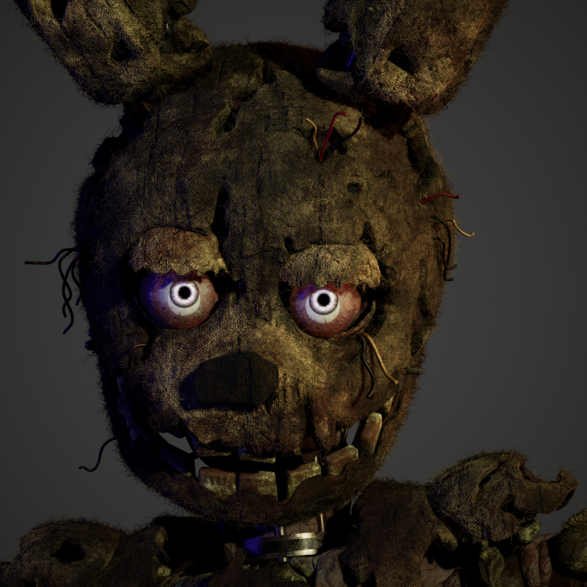
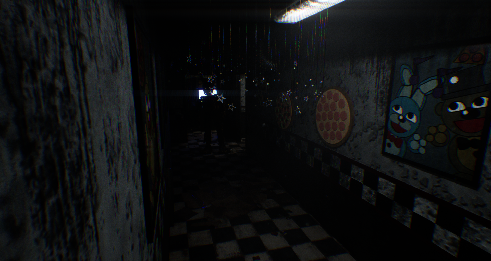

<h1 align="center">Hi 👋, I'm Uladzislau Seviaryn</h1>
<h3 align="center">An indie game developer from Poland</h3>

I'm currently studying informatics at the University of Gdańsk and plan to obtain bachelor's degree in mid-2026. My interests and skills however are more specialized around game development with Unreal Engine. I've already done a few projects before, for instance:
- [Creepy Nights at Freddy's](https://gamejolt.com/games/cnaf/316567)
- [Creepy Nights at Freddy's 2](https://gamejolt.com/games/cnaf2/459360)
- [Creepy Nights at Freddy's 2 \[Android\]](https://play.google.com/store/apps/details?id=com.Ravenstone.CNaF2)

I'm still learning Unreal Engine (new things appear faster than I'm able to learn them, aha) and try to apply my knowledge in another project of mine which I'm working on when I have enough spare time. Here's some screenshots:

The development requires a lot of time and effort, so if you're willing to help it will be much appreciated!

Sometimes I also work on a small project named **Atom** which is a client-server desktop application built with Avalonia.UI and .NET (C#) with a potential to become something more.

Other than that, I'm a huge metal music fan and like almost any form of art including music, games, arts, films, books, etc.

### How to reach me? Send me an email on **deepinnothing@gmail.com** or connect with me on social networks:

<h3 align="left">Languages and Tools:</h3>

         

⚡ Fun fact **I think I'm OlDD**

**Lorem ipsum**
